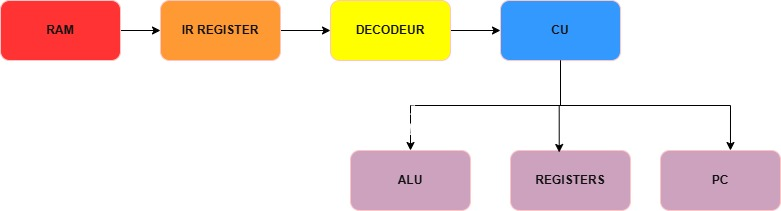
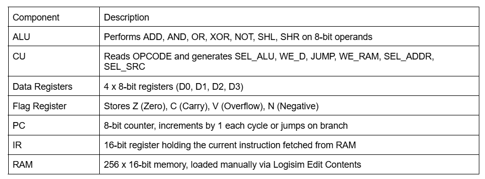
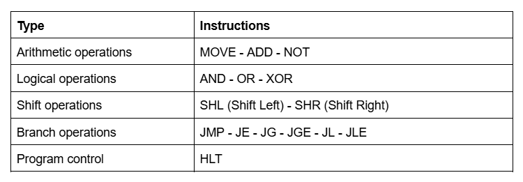
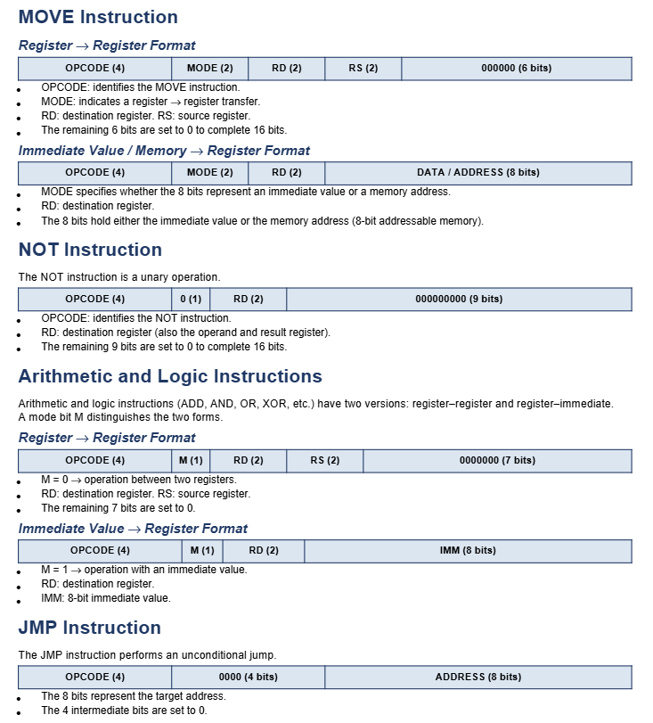
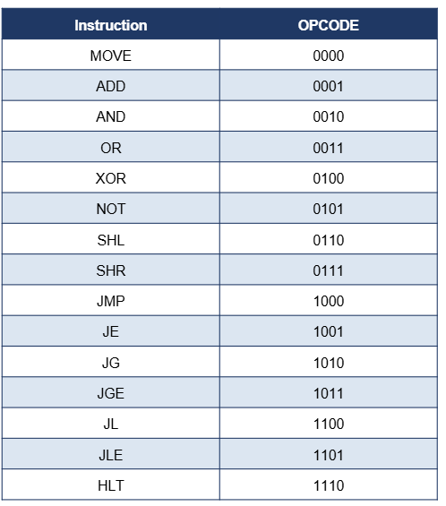

## CPU008 - Logisim 

This project is a simulation of an 8-bit Central Processing Unit (CPU) 
built in Logisim. The CPU is based on a simplified Von Neumann architecture 
with a RISC instruction set, and is composed of the following components:

- **ALU** (Arithmetic and Logic Unit): handles all arithmetic and logical operations
- **Control Unit (CU)**: decodes instructions and generates control signals
- **Register File**: 4 general-purpose 8-bit data registers (D0–D3)
- **Flag Register**: stores the 4 status flags (Z, C, V, N)
- **Program Counter (PC)**: points to the next instruction to execute
- **Instruction Register (IR)**: holds the current 16-bit instruction
- **RAM**: 256 x 16-bit memory for storing instructions and data

## Architecture

### General Schema

The CPU operates on a classic **Fetch → Decode → Execute** cycle:
1. **Load**: All instructions are manually loaded into RAM via 
   Logisim's Edit Contents feature.
2. **Fetch**: The Program Counter (PC) holds the address of the 
   next instruction. The RAM sends the 16-bit instruction at that 
   address to the Instruction Register (IR). The PC then increments 
   by 1 automatically.
3. **Decode**: The instruction stored in the IR is split into 
   separate fields by a splitter circuit. Each field is then 
   sent to the appropriate component: the OPCODE goes to the 
   Control Unit, the register fields (RD, RS) go to the register 
   file multiplexers, and the immediate value (IMM) goes to the 
   ALU input multiplexer.
4. **Execute**: The Control Unit (CU) receives the decoded fields 
   and generates control signals to orchestrate all components:
   - **SEL_ALU** → tells the ALU which operation to perform
   - **WE_D** → enables writing to the destination register
   - **JUMP** → tells the PC to jump to a new address
   - **SEL_SRC** → selects the source of the result
   - **SEL_ADDR** → selects the RAM address source
   - **WE_RAM** → enables writing to RAM
  
### Components Details

### Instruction Set Definition

### Instruction Formats
All instructions are 16-bit fixed-length encoded in binary.

The MOVE instruction uses a 2-bit MODE field to distinguish between 
the different types of data transfer:

- **MODE 00** - Register to Register: transfers the value of a source 
  register (RS) directly into a destination register (RD).
- **MODE 01** - Immediate to Register: loads a constant 8-bit value 
  (IMM) directly from the instruction into the destination register (RD)
- **MODE 10** - Memory to Register: reads the value stored at a given 
  memory address (ADDRESS) from RAM and loads it into the destination 
  register (RD).
- **MODE 11** - Register to Memory: *(not supported in this implementation 
  due to Logisim's RAM bidirectional pin limitation)

  ### Instructions Table
  

## How to Use
**Note:** The main circuit of this project is named **CPU**. 
### Requirements
- [Logisim](http://www.cburch.com/logisim/) - download and install

### 1 - Open the circuit
- Download the file `cpu.circ` from this repository
- Open it in Logisim

### 2 - Load a program into RAM
- Right-click on the **RAM** component in the circuit
- Select **Edit Contents**
- Enter your instructions in hexadecimal at each address
- Start from address `00`

### 3 - Run the simulation
- Go to **Simulate → Auto-Tick** to run automatically
- Or press **Ctrl+T** to advance one clock tick at a time
- Recommended frequency: **Simulate → Tick Frequency → 1 Hz** 
  for easy step-by-step debugging

### 4 - Observe the results
- Watch the **data registers (D0–D3)** to see the results
- Watch the **flag register (Z, C, V, N)** for status updates
- Watch the **PC** to follow instruction execution
  
  

